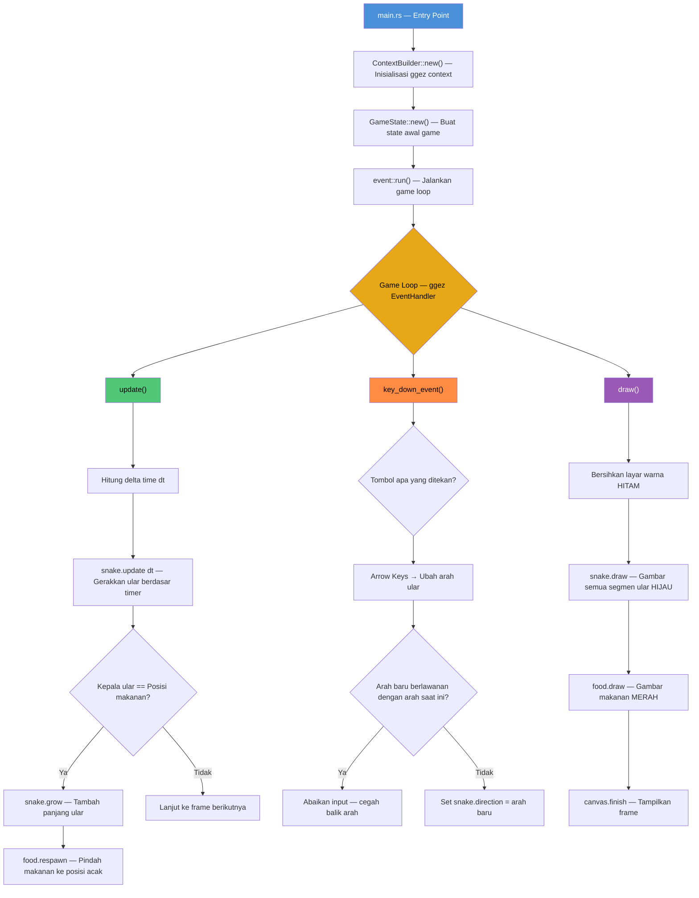
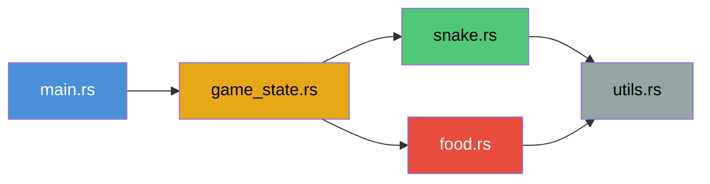

# 🐍 Snake Game — Dokumentasi Alur Kerja Kode

## Gambaran Umum

Proyek ini adalah implementasi permainan **Snake** klasik yang ditulis dalam bahasa **Rust**, menggunakan library game engine **ggez** untuk rendering grafis dan handling input. Ular bergerak di grid, memakan makanan untuk bertambah panjang, dan pemain mengontrol arah ular menggunakan tombol panah keyboard.

---

## Struktur Proyek

```
snake_game/
├── Cargo.toml          # Konfigurasi proyek & dependensi
├── src/
│   ├── main.rs         # Entry point — inisialisasi game
│   ├── game_state.rs   # State utama game & game loop (update, draw, input)
│   ├── snake.rs        # Logika ular (gerakan, pertumbuhan, rendering)
│   ├── food.rs         # Logika makanan (posisi, respawn, rendering)
│   └── utils.rs        # Fungsi utilitas (konversi grid ke piksel)
```

---

## Dependensi

| Crate  | Versi  | Kegunaan                              |
|--------|--------|---------------------------------------|
| `ggez` | 0.9    | Game engine (grafis, input, event loop) |
| `rand` | 0.8    | Penempatan makanan secara acak        |

---

## Diagram Alur Kerja



---

## Penjelasan Detail Setiap File

### 1. `main.rs` — Entry Point

```
main() → ContextBuilder → GameState::new() → event::run()
```

**Tanggung jawab:**
- Mendaftarkan semua module (`mod game_state`, `mod food`, `mod snake`, `mod utils`)
- Membuat **ggez context** dengan nama game `"snake_game"` dan author `"gufanto"`
- Membuat instance `GameState` baru
- Memulai **game loop** lewat `event::run()`

**Kode kunci:**
```rust
let (ctx, event_loop) = ContextBuilder::new("snake_game", "gufanto").build()?;
let state = GameState::new();
event::run(ctx, event_loop, state)
```

---

### 2. `game_state.rs` — Otak Permainan

**Struktur:**
```rust
pub struct GameState {
    snake: Snake,   // Objek ular
    food: Food,     // Objek makanan
}
```

**Implementasi `EventHandler` (3 fungsi utama):**

| Fungsi | Kapan Dipanggil | Apa yang Dilakukan |
|--------|----------------|-------------------|
| `update()` | Setiap frame | Menggerakkan ular, cek tabrakan dengan makanan |
| `key_down_event()` | Saat tombol ditekan | Mengubah arah ular berdasarkan input keyboard |
| `draw()` | Setiap frame (setelah update) | Menggambar ular dan makanan ke layar |

#### `update()` — Logika Permainan
1. Ambil `delta time` (waktu sejak frame sebelumnya)
2. Panggil `snake.update(dt)` untuk menggerakkan ular
3. Cek apakah kepala ular menyentuh makanan:
   - **Ya** → `snake.grow()` + `food.respawn()`
   - **Tidak** → Lanjut

#### `key_down_event()` — Input Keyboard
1. Baca keycode dari input
2. Map tombol panah ke arah: `Up(0,-1)`, `Down(0,1)`, `Left(-1,0)`, `Right(1,0)`
3. **Validasi**: Cegah ular berbalik 180° (contoh: jika bergerak ke atas, tidak bisa langsung ke bawah)
4. Set `snake.direction` dengan arah baru

#### `draw()` — Rendering
1. Buat canvas dengan background **hitam**
2. Gambar ular (hijau)
3. Gambar makanan (merah)
4. Tampilkan frame ke layar

---

### 3. `snake.rs` — Logika Ular

**Struktur:**
```rust
pub struct Snake {
    pub body: Vec<(i32, i32)>,      // Segmen tubuh (grid coordinates)
    pub direction: (i32, i32),       // Arah gerak saat ini
    pub move_delay: f32,             // Delay antar gerakan (0.15 detik)
    pub timer: f32,                  // Penghitung waktu berjalan
}
```

**Inisialisasi:**
- Posisi awal body: `[(10,10), (10,11), (10,12)]` → 3 segmen
- Arah awal: `(0, -1)` → ke atas
- Kecepatan: bergerak setiap **150ms**

**Fungsi-fungsi:**

| Fungsi | Deskripsi |
|--------|-----------|
| `new()` | Inisialisasi ular dengan 3 segmen, arah ke atas |
| `update(dt)` | Akumulasi timer, gerakkan ular jika timer >= delay |
| `head_position()` | Kembalikan posisi kepala ular `body[0]` |
| `grow()` | Tambah segmen baru di ekor (duplikasi elemen terakhir) |
| `draw()` | Gambar setiap segmen sebagai kotak hijau 20x20 piksel |

**Mekanisme Pergerakan (time-based):**
```
timer += dt
if timer >= move_delay (0.15s):
    1. Hitung posisi kepala baru = kepala saat ini + direction
    2. Sisipkan kepala baru di depan body
    3. Hapus elemen terakhir body (ekor)
    4. Reset timer ke 0
```

> Ini membuat ular bergerak dengan kecepatan tetap (~6.67 langkah/detik), terlepas dari FPS.

---

### 4. `food.rs` — Logika Makanan

**Struktur:**
```rust
pub struct Food {
    pub position: (i32, i32),  // Posisi makanan di grid
}
```

**Fungsi-fungsi:**

| Fungsi | Deskripsi |
|--------|-----------|
| `new()` | Makanan awal di posisi `(15, 15)` |
| `respawn()` | Pindah ke posisi acak dalam grid 20x20 |
| `draw()` | Gambar sebagai kotak merah 20x20 piksel |

**Mekanisme Respawn:**
```rust
position = (rand::random::<i32>().abs() % 20, rand::random::<i32>().abs() % 20)
```

---

### 5. `utils.rs` — Fungsi Utilitas

Satu fungsi untuk konversi koordinat **grid** ke **piksel**:

```rust
pub fn grid_to_pixel(pos: (i32, i32)) -> (f32, f32) {
    (pos.0 as f32 * 20.0, pos.1 as f32 * 20.0)
}
```

**Penjelasan:**
- Grid game berukuran 20x20 cell
- Setiap cell berukuran 20x20 piksel
- Jadi posisi grid `(5, 3)` → piksel `(100.0, 60.0)`

---

## Alur Eksekusi Lengkap (Step by Step)

```
1. Program dimulai di main()
2. ggez context dibuat (window, graphics, dll)
3. GameState dibuat:
   ├── Snake: 3 segmen di (10,10)→(10,12), arah ke atas
   └── Food: di posisi (15,15)
4. Game loop dimulai (event::run)
   │
   ├── [Setiap Frame]
   │   ├── update():
   │   │   ├── Tambah dt ke snake.timer
   │   │   ├── Jika timer >= 0.15: gerakkan ular
   │   │   └── Cek collision kepala-makanan → grow + respawn
   │   │
   │   └── draw():
   │       ├── Clear layar (hitam)
   │       ├── Gambar semua segmen ular (kotak hijau 20x20)
   │       ├── Gambar makanan (kotak merah 20x20)
   │       └── Tampilkan ke window
   │
   └── [Saat Tombol Ditekan]
       └── key_down_event():
           ├── Map tombol panah ke arah
           ├── Validasi (tidak boleh balik 180°)
           └── Update snake.direction
```

---

## Sistem Koordinat & Grid

```
   0   1   2   3  ...  19    (x → kolom)
 ┌───┬───┬───┬───┬───┬───┐
0│   │   │   │   │   │   │
 ├───┼───┼───┼───┼───┼───┤
1│   │   │   │   │   │   │
 ├───┼───┼───┼───┼───┼───┤
2│   │   │   │   │   │   │
 ├───┼───┼───┼───┼───┼───┤
 ...
 ├───┼───┼───┼───┼───┼───┤
19│  │   │   │   │   │   │
 └───┴───┴───┴───┴───┴───┘
 (y → baris)

 Setiap cell = 20x20 piksel
 Total window = 400x400 piksel
```

---

## Relasi Antar Module



| Module | Bergantung Pada |
|--------|----------------|
| `main.rs` | `game_state` |
| `game_state.rs` | `snake`, `food` |
| `snake.rs` | `utils` |
| `food.rs` | `utils` |
| `utils.rs` | *(tidak bergantung pada module lain)* |

---

## Catatan Tambahan

> **Fitur yang belum diimplementasi:**
> - **Deteksi game over** — ular bisa keluar layar atau menabrak dirinya sendiri tanpa efek
> - **Sistem skor** — pertumbuhan ular bisa dihitung sebagai skor
> - **Boundary wrapping/wall** — ular tidak dibatasi oleh tepi layar
> - **Kecepatan dinamis** — `move_delay` bisa dikurangi seiring bertambahnya skor untuk menambah kesulitan
